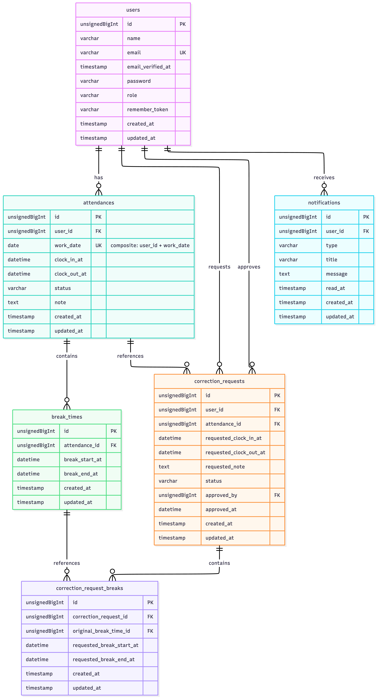

# 勤怠管理アプリ

## 概要

一般ユーザーの出勤・退勤・休憩打刻、勤怠一覧、勤怠詳細、修正申請、勤怠レポートを管理するアプリケーションです。

管理者はスタッフ別の勤怠確認、勤怠修正、修正申請の承認、CSV出力を行えます。

## 使用技術

- PHP 8.1
- Laravel 10
- Laravel Fortify
- Laravel Sanctum
- MySQL 8.4
- Laravel Sail
- Vite
- Tailwind CSS

Tailwind CSS はユーティリティクラスを基本にしつつ、共通レイアウト・ボタン・テーブル・詳細画面などの再利用スタイルは `resources/css/app.css` の `@layer components` にまとめています。

## 環境構築

### 1. リポジトリを取得

```bash
git clone https://github.com/AliettaA/attendance-app.git
cd attendance-app
```

### 2. PHP依存パッケージをインストール

```bash
composer install
```

ローカルに Composer がない場合は、Docker を使ってインストールできます。

```bash
docker run --rm \
  -u "$(id -u):$(id -g)" \
  -v "$(pwd):/var/www/html" \
  -w /var/www/html \
  laravelsail/php83-composer:latest \
  composer install --ignore-platform-reqs
```

### 3. 環境変数ファイルを作成

```bash
cp .env.example .env
```

`.env` ファイル作成後、データベース設定が Laravel Sail の MySQL コンテナに合わせて以下の内容になっていることを確認してください。

```env
DB_CONNECTION=mysql
DB_HOST=mysql
DB_PORT=3306
DB_DATABASE=laravel
DB_USERNAME=sail
DB_PASSWORD=password
```

メール認証を MailHog で確認する場合は、メール設定も以下のように変更してください。

```env
MAIL_MAILER=smtp
MAIL_HOST=mailhog
MAIL_PORT=1025
MAIL_USERNAME=null
MAIL_PASSWORD=null
MAIL_ENCRYPTION=null
MAIL_FROM_ADDRESS="hello@example.com"
MAIL_FROM_NAME="${APP_NAME}"
```

### 4. Dockerコンテナを起動

```bash
./vendor/bin/sail up -d
```

### 5. アプリケーションキーを作成

```bash
./vendor/bin/sail artisan key:generate
```

### 6. データベースを作成

```bash
./vendor/bin/sail artisan migrate:fresh --seed
```

### 7. フロントエンド依存パッケージをインストール

```bash
./vendor/bin/sail npm install
```

### 8. フロントエンドをビルド

```bash
./vendor/bin/sail npm run build
```

開発中に CSS の変更を確認しながら作業する場合は、以下を実行します。

```bash
./vendor/bin/sail npm run dev
```

## URL

| URL | 説明 |
| --- | --- |
| http://localhost | アプリ |
| http://localhost/register | 一般ユーザー会員登録 |
| http://localhost/login | 一般ユーザーログイン |
| http://localhost/attendance | 一般ユーザー勤怠登録 |
| http://localhost/attendance/list | 一般ユーザー勤怠一覧 |
| http://localhost/attendance/report | マイ勤怠レポート |
| http://localhost/stamp_correction_request/list | 修正申請一覧 |
| http://localhost/admin/login | 管理者ログイン |
| http://localhost/admin/attendance/list | 管理者勤怠一覧 |
| http://localhost/admin/staff/list | スタッフ一覧 |
| http://localhost:8080 | phpMyAdmin |
| http://localhost:8025 | MailHog |

## テストアカウント

`migrate:fresh --seed` 実行後、以下のアカウントを利用できます。

| 権限 | メールアドレス | パスワード |
| --- | --- | --- |
| 一般ユーザー | user1@example.com | password |
| 一般ユーザー | user2@example.com | password |
| 管理者 | user3@example.com | password |

## 主な機能

### 一般ユーザー

- 会員登録
- ログイン / ログアウト
- メール認証
- 出勤 / 退勤
- 休憩開始 / 休憩終了
- 月別勤怠一覧
- 勤怠詳細表示
- 勤怠修正申請
- 修正申請一覧
- マイ勤怠レポート

### 管理者

- 管理者ログイン / ログアウト
- 日別勤怠一覧
- 勤怠詳細表示
- 勤怠修正
- スタッフ一覧
- スタッフ別勤怠一覧
- スタッフ別勤怠CSV出力
- 修正申請一覧
- 修正申請承認

## API

公開APIとして、勤怠レコードの取得・登録・更新・削除を提供しています。
API上のリソース名は `attendance-records`、実際に保存されるテーブル名は `attendances` です。

| メソッド | パス | 認証 | 説明 |
| --- | --- | --- | --- |
| GET | `/api/v1/attendance-records` | 不要 | 勤怠一覧取得 |
| GET | `/api/v1/attendance-records/{attendanceRecord}` | 不要 | 勤怠詳細取得 |
| POST | `/api/v1/attendance-records` | 必要 | 勤怠登録 |
| PUT/PATCH | `/api/v1/attendance-records/{attendanceRecord}` | 必要 | 勤怠更新 |
| DELETE | `/api/v1/attendance-records/{attendanceRecord}` | 必要 | 勤怠削除 |

認証が必要なAPIでは Laravel Sanctum のトークンを使用します。

### 勤怠一覧取得のクエリパラメータ

| パラメータ | 必須 | 説明 |
| --- | --- | --- |
| `user_id` | 任意 | 指定したユーザーの勤怠に絞り込み |
| `date` | 任意 | 指定した日付の勤怠に絞り込み。形式は `YYYY-MM-DD` |
| `month` | 任意 | 指定した月の勤怠に絞り込み。形式は `YYYY-MM` |
| `per_page` | 任意 | 1ページあたりの取得件数。最大100件 |
| `page` | 任意 | ページ番号 |

### 登録・更新時の主なリクエスト項目

| 項目 | 説明 |
| --- | --- |
| `date` | 勤務日。形式は `YYYY-MM-DD` |
| `clock_in` | 出勤時刻。形式は `HH:MM:SS` |
| `clock_out` | 退勤時刻。形式は `HH:MM:SS` |
| `comment` | 備考 |

## テスト

```bash
./vendor/bin/sail artisan test
```

APIテストのみ実行する場合:

```bash
./vendor/bin/sail artisan test tests/Feature/Api
```

テストでは `phpunit.xml` の設定により、テスト用データベース `testing` を使用します。

テスト用データベースが存在しない場合は、MySQLコンテナ内で作成してください。

```bash
./vendor/bin/sail mysql
```

```sql
CREATE DATABASE testing;
```

## ER図

タイトル: 勤怠管理アプリ ER図（データベース設計）



## テーブル設計

| テーブル | 説明 |
| --- | --- |
| users | ユーザー情報 |
| attendances | 勤怠情報 |
| break_times | 休憩時間 |
| correction_requests | 勤怠修正申請 |
| correction_request_breaks | 修正申請に紐づく休憩時間 |
| notifications | 通知 |
| personal_access_tokens | API認証トークン |
| sessions | セッション情報 |

## メール設定

初期設定では MailHog を使用します。メール認証メールは以下で確認できます。

```text
http://localhost:8025
```

Mailtrap を使用する場合は、`.env` の `MAIL_*` を Mailtrap の SMTP 設定に変更し、設定キャッシュをクリアしてください。

```bash
./vendor/bin/sail artisan config:clear
```

## トラブルシューティング

### ポートが競合する場合

`80` や `8080` がすでに使用されている場合は、`.env` に以下のように設定してポートを変更してください。

```env
APP_PORT=8081
PHPMYADMIN_PORT=8082
```

変更後、コンテナを再起動します。

```bash
./vendor/bin/sail down
./vendor/bin/sail up -d
```

### CSSの変更が反映されない場合

本アプリは Vite と Tailwind CSS を使用しています。CSSを変更した後、画面に反映されない場合は以下を実行してください。

```bash
./vendor/bin/sail npm run build
```

開発中は以下を起動した状態で確認できます。

```bash
./vendor/bin/sail npm run dev
```

### データベースを初期化したい場合

開発環境でデータを作り直す場合は、以下を実行します。

```bash
./vendor/bin/sail artisan migrate:fresh --seed
```

MySQL のボリュームごと初期化したい場合は、保存済みデータが削除される点に注意して以下を実行してください。

```bash
./vendor/bin/sail down -v
./vendor/bin/sail up -d
./vendor/bin/sail artisan migrate:fresh --seed
```

### 勤怠未登録日の修正申請について

勤怠未登録日の修正申請については、実装途中でコーチに確認したうえで、補足機能として実装しています。

本アプリでは、勤怠が登録されている日の修正申請に加えて、勤怠未登録日についても勤怠詳細画面から修正申請を作成できます。管理者が承認すると、申請内容をもとに勤怠データが作成されます。
